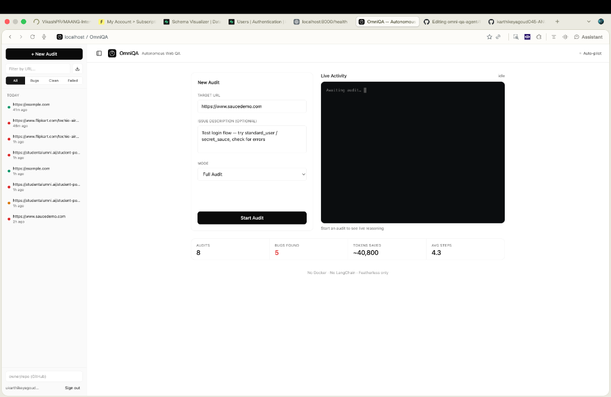
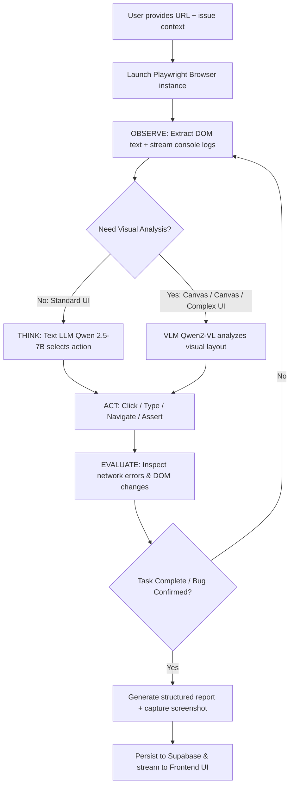

<p align="center">
  
  <h1 align="center">OmniQA</h1>
  <p align="center">
    <strong>Autonomous Web QA that finds bugs before your users do.</strong>
  </p>
  <p align="center">
    <a href="#-quick-start-30-seconds-to-running"></a>
    
    
    
    
  </p>
</p>

<p align="center">
  
</p>

---

## 💡 What is OmniQA?

> **OmniQA is an autonomous QA engineer that physically controls a browser, reasons about bugs using AI, and writes evidence-based reports — without requiring manual test scripts.**

Unlike legacy test frameworks (Selenium, Cypress) that break whenever a selector changes, or naive LLM wrappers that burn hundreds of dollars on repetitive full-page screenshots, OmniQA operates via a **real-time ReAct loop**. It analyzes DOM structure, listens to browser console errors, interacts with pages through natural actions, and synthesizes crisp, actionable bug verdicts.

---

## ✨ Key Features

| Feature | Description |
| :--- | :--- |
| 🤖 **Autonomous Navigation** | Physically controls Chrome via Playwright, clicking buttons, handling modals, and filling forms like a real user. |
| 🧠 **Verdict Intelligence** | Accurately separates genuine user-facing bugs from third-party network noise (CDN 406s, analytics beacons). |
| ⚡ **Token Efficiency** | **Tiered Sensor System**: DOM text + console stream = 0 tokens. Only ~800 tokens per action step. |
| 📊 **ChatGPT-Style Workspace** | Collapsible audit history sidebar, real-time live terminal streaming, and main-canvas report generation. |
| 🔒 **Security-First Architecture** | Zero GitHub PAT required; instant one-click clipboard export of markdown reports formatted for issues. |
| 🛑 **Graceful Cancellation** | Stop an audit mid-flight cleanly; closes browser context safely and flags status as `STOPPED`. |
| 🎯 **Dual Execution Modes** | Full Audit (deep autonomous discovery & verification) or Quick Check (smoke test). |
| 📸 **Verifiable Visual Proof** | Automatically captures high-res screenshots, timestamped execution steps, and full console trace logs. |

---

## 🏗️ Architecture



### The Autonomous ReAct Loop
1. **OBSERVE**: Read semantic DOM trees, accessibility nodes, and browser console errors in real time with zero token cost.
2. **THINK**: Reason about the next logical user step using fast open-source models on Featherless.ai.
3. **ACT**: Execute precision browser actions (mouse clicks, keyboard input, route changes) via Playwright.
4. **EVALUATE**: Continuously monitor state transitions, unexpected errors, and assertion points.

---

## 💰 Token Efficiency: Why OmniQA Costs ~$0.02 / Audit

Most AI QA agents burn thousands of tokens per test step by shipping entire multi-megabyte screenshots to vision models. OmniQA introduces a **Tiered Sensor System**:

```
+-------------------------------------------------------------------------+
|                         TIERED SENSOR SYSTEM                            |
|                                                                         |
|  [Tier 1] DOM Text & Accessibility Tree  ───> 0 Tokens   (90% of steps)  |
|  [Tier 2] Live Console & Network Stream  ───> 0 Tokens   (Continuous)   |
|  [Tier 3] Fast Text LLM (Qwen 2.5-7B)    ───> ~800 Tokens / Action      |
|  [Tier 4] Vision LLM (Qwen2-VL Fallback) ───> ~2,000 Tokens (On Demand) |
+-------------------------------------------------------------------------+
```

| Sensor | Cost | When Used |
| :--- | :--- | :--- |
| **DOM Text Extraction** | **0 tokens** | Every step (parses structured text and interactive elements) |
| **Console Logs** | **0 tokens** | Every step (captures unhandled exceptions and JS stack traces) |
| **Text LLM (Qwen 2.5-7B)** | **~800 tokens/step** | Decides next action (click, fill, navigate, evaluate) |
| **Vision LLM (Qwen2-VL)** | **~2,000 tokens** | Only invoked when DOM is unreadable (Canvas, complex WebGL) |

> 💵 **Result:** A comprehensive 10-step audit costs **~8,000 tokens (~$0.02)** compared to **~50,000 tokens (~$0.15+)** with naive vision-only agents.
>
> 🚀 **Sponsor Integration:** Powered by [Featherless.ai](https://featherless.ai), providing resilient low-latency inference across 30,000+ open-source models with automatic model fallback chains.

---

## 🔒 Security-First Design

| Principle | Implementation |
| :--- | :--- |
| **No GitHub PAT Required** | Generates zero-trust Markdown issue reports with embedded screenshots copied directly to clipboard for manual paste. |
| **Strict Secret Isolation** | API credentials and keys reside strictly in server `.env` files; zero sensitive tokens exposed to the client. |
| **Supabase Row-Level Security** | Supabase RLS enforces read permissions (`anon` SELECT), restricting mutations to verified `service_role`. |
| **Local Resilient Fallback** | If database connection fails, reports automatically persist to local `reports.json` so demos never fail. |
| **Ephemeral Sandboxing** | Browser contexts are isolated per session and automatically terminated upon completion or cancellation. |

---

## 🏆 Hackathon Strategy: Built for "Build by Sunset — HackWave 3.0"

OmniQA was purpose-built to deliver on the core judging criteria of **HackWave 3.0**:

| Principle | How OmniQA Delivers |
| :--- | :--- |
| **Systems, not demos** | Complete end-to-end data lifecycle: Supabase persistence, re-runnable session history, and live SSE event streams. |
| **Agents, not prompts** | True autonomous ReAct control loop executing dynamic multi-step browser tool operations. |
| **Decisions, not outputs** | Agent evaluates real-time DOM/console feedback to adaptively decide the next user interaction. |
| **Real-world relevance** | Directly eliminates the developer fatigue of writing flaky end-to-end test scripts and reproduction steps. |
| **Sponsor track depth** | Deep integration with [Featherless.ai](https://featherless.ai) API leveraging open-source LLMs (`Qwen/Qwen2.5-7B-Instruct`). |
| **Anti-boring engineering** | Clean glassmorphic UI, live interactive terminal feed, and single-click full reproduction walkthroughs. |

### Technical Constraints Honored:
- ✅ **No Docker bloat** (Fast local execution & instant teardown)
- ✅ **Zero framework overhead** (Native async ReAct loop without LangChain/LangGraph abstractions)
- ✅ **Extreme token efficiency** via Tiered Sensors
- ✅ **Security-first** zero-trust design

---

## 🚀 Quick Start (30 seconds to running)

### Prerequisites
- **Python 3.11+**
- **Node.js 18+** & **npm**
- **Supabase Account** ([Free Tier](https://supabase.com))
- **Featherless.ai API Key** ([Free Credits](https://featherless.ai))

### 1. Clone & Install

```bash
git clone https://github.com/karthikeyagoud045-ANU/omni-qa-agent.git
cd omni-qa-agent

# Backend Setup
cd backend
python -m venv .venv
source .venv/bin/activate  # On Windows: .venv\Scripts\activate
pip install -r requirements.txt
playwright install chromium

# Frontend Setup
cd ../frontend
npm install
cd ..
```

### 2. Configure Environment

Create a `.env` file in the root directory:

```env
SUPABASE_URL=https://your-project.supabase.co
SUPABASE_ANON_KEY=your_supabase_anon_key
SUPABASE_SERVICE_ROLE_KEY=your_supabase_service_role_key
FEATHERLESS_API_KEY=your_featherless_api_key
FEATHERLESS_BASE_URL=https://api.featherless.ai/v1
HEADLESS=false
FRONTEND_URL=http://localhost:5173
BACKEND_URL=http://localhost:8000
```

### 3. Launch

Run both the frontend and backend with a single command:

```bash
./start.sh
```

*Or launch manually in separate terminals:*
```bash
# Terminal 1: Backend
cd backend && uvicorn main:app --reload --port 8000

# Terminal 2: Frontend
cd frontend && npm run dev
```

Visit **`http://localhost:5173`** to begin your first autonomous QA audit!

---

## 🛠️ Tech Stack

| Layer | Technology | Rationale |
| :--- | :--- | :--- |
| **Frontend** | React 18, Vite, Tailwind CSS | Lightning-fast HMR, lightweight bundle, responsive dark-mode styling |
| **Backend API** | Python, FastAPI, Uvicorn | High-throughput asynchronous runtime with native async Playwright support |
| **Browser Engine** | Playwright (Chromium) | High-fidelity headless/headed browser control and full DOM instrumentation |
| **Database & Storage** | Supabase (PostgreSQL + Buckets) | Real-time subscriptions, RLS policies, and asset storage |
| **AI Inference** | Featherless.ai | Serverless access to 30,000+ open-weights models via OpenAI-compatible endpoints |
| **Primary LLM** | `Qwen/Qwen2.5-7B-Instruct` | Exceptional structured JSON generation, fast inference, and reasoning capabilities |
| **Vision Model** | `Qwen/Qwen2-VL-7B-Instruct` | High-precision visual element understanding when DOM tree is obfuscated |
| **Streaming** | Server-Sent Events (SSE) | Unidirectional low-latency event streaming to the browser terminal |
| **Icons & UI** | Lucide React | Clean, modern iconography |

---

## 📸 Screenshots

<p align="center">
  
</p>

---


## 🗺️ Roadmap

### 🌟 v1.1 (Post-Hackathon)
- [ ] **Scheduled Audits**: Cron-based automated background regression monitoring.
- [ ] **Visual Pixel Diffing**: Baseline screenshot comparisons for visual regression tests.
- [ ] **Webhook Integrations**: Instant Slack, Discord, and Linear notification dispatches.
- [ ] **Team Workspaces**: Multi-tenant organizations with shared test histories.

### ⚡ v1.2
- [ ] **Multi-Browser Matrix**: Concurrent execution across Firefox, WebKit, and Chromium.
- [ ] **Responsive Emulation**: Automated device viewport testing (Mobile, Tablet, Desktop).
- [ ] **CI/CD Integration**: Native GitHub Actions and GitLab CI audit triggers.

### 🔮 v2.0
- [ ] **Self-Healing Selectors**: AI automatically updates broken selectors when DOM refactors occur.
- [ ] **Core Web Vitals & Performance Budgets**: Automatic audit failure on LCP, CLS, or INP thresholds.
- [ ] **A11y Remediation Engine**: Automatic WCAG compliance scanning and automated fix recommendations.

---

## 📄 License

Distributed under the **MIT License**. See `LICENSE` for more information.

---

## 🙏 Acknowledgments

- **[Featherless.ai](https://featherless.ai)** — For sponsoring **HackWave 3.0** and providing open-source model inference.
- **[Supabase](https://supabase.com)** — For developer-friendly Postgres database and storage infrastructure.
- **[SauceDemo](https://www.saucedemo.com)** — For the battle-tested web playground used for QA validation.

---

<p align="center">
  <strong>Built with ❤️ for Build by Sunset — HackWave 3.0</strong><br />
  <em>OmniQA: Autonomous QA that finds bugs before your users do.</em>
</p>
