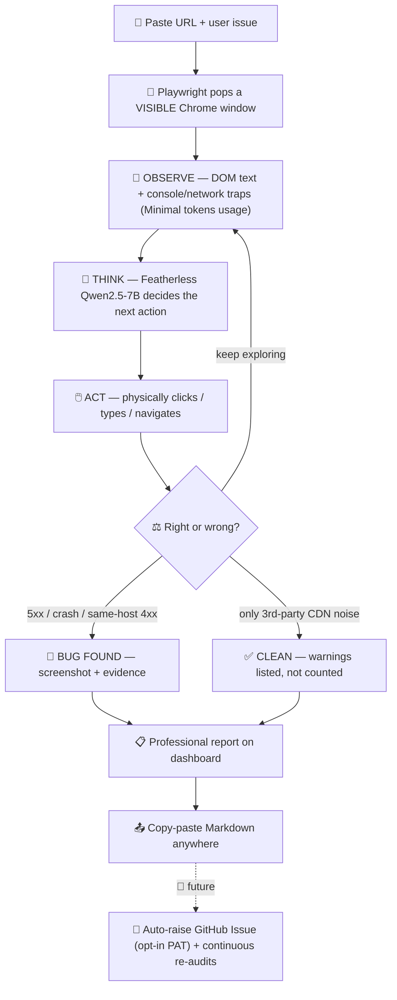

<p align="center">
  <h1 align="center">🤖 OmniQA</h1>
  <p align="center"><strong>The Autonomous QA Engineer that clicks, checks, and reports — so humans don't have to.</strong></p>
  <p align="center">
    
    
    
    
  </p>
</p>

---

## 🎯 Why OmniQA Exists

A QA engineer's day looks like this: **read 30 user issues → open the site → manually reproduce each one → click through the same flows → screenshot the bug → write the report → paste it into Jira/GitHub.** It's slow, repetitive, and exhausting.

**OmniQA automates the entire loop.** You just:

1. **Paste the URL** of your website.
2. **Paste the user issue** in plain English — *"checkout goes blank with a Yahoo email."*

That's it. The AI **understands the issue, opens a real visible browser, and tries exactly what the user described.** If the bug is real → it captures screenshot + console + network evidence and drops a **professional report on your dashboard, ready to copy-paste anywhere** (GitHub, Jira, Slack). If it's not reproducible → it tells you *CLEAN* and shows what it checked. No manual clicking. No flaky test scripts. No guesswork about what's correct and what's wrong.

> **Example:** User says *"the discount code doesn't work."*
> You paste URL + issue → OmniQA launches Chrome, adds to cart, applies the code, watches the console, finds the HTTP 404 on `/api/coupon` → **BUG_FOUND** → dashboard shows the report with screenshot & steps → one click → Markdown on your clipboard → paste into the ticket. **Done in 30 seconds, not 30 minutes.**

---

## 🔄 How It Works — The Workflow



**The ReAct loop:** OBSERVE → THINK → ACT → EVALUATE, repeated until a verdict (max 12 steps = safety circuit breaker). You watch every click live — zero hidden magic.

---

## ✨ What Makes It Special

| Capability | Why it matters |
|---|---|
| 👀 **Visible autonomy** | A real browser window pops up and does the work in front of you (`headless=False`) |
| ⚡ **Tiered Sensors (0-token perception)** | Reads compressed DOM text + console logs for **free**; LLM only *decides* (~800 tokens/step) → ~$0.02 per audit |
| ⚖️ **Verdict Intelligence** | Knows the difference between a real bug and background noise (Flipkart's CDN 406s = warnings, not bugs) |
| 📋 **Copy-paste anywhere** | One click → clean Markdown report (steps + evidence + suggested fix) on your clipboard |
| 🛑 **Stop anytime** | Cancel mid-audit; browser closes gracefully, partial report saved |
| 📚 **History that remembers** | ChatGPT-style sidebar: every audit saved, re-runnable, dismissible |
| 🔐 **Security-first today** | No GitHub PAT needed now — clipboard export + PAT-free prefilled issue URLs |

---

## 🚀 How To Use It Locally (Clone → Run → Audit)

**Prerequisites:** Python 3.11+, JS, Node 18+, a free [Supabase](https://supabase.com) account, a [Featherless.ai](https://featherless.ai) API key.

```bash
# 1) Clone
git clone https://github.com/karthikeyagoud045-ANU/omni-qa-agent.git
cd omni-qa-agent

# 2) Backend
cd backend
python -m venv .venv
source .venv/bin/activate          # Windows: .venv\Scripts\activate
pip install -r requirements.txt
playwright install chromium

# 3) Frontend
cd ../frontend && npm install

# 4) Keys
cd .. && cp .env.example .env      # paste Supabase URL/keys + Featherless key

# 5) Launch
./start.sh
```

**Then:**
1. Open **http://localhost:5173** → *Continue as guest* (or Google login).
2. Paste your **Target URL** and the **user issue**.
3. Pick **Full Audit** (deep) or **Quick Check** (smoke) → **Start Audit**.
4. **Watch the browser work** while reasoning streams live in the terminal.
5. When done → open the report from the sidebar → **Export / Copy** → paste anywhere.

---

## 🛠️ Tech Stack

**Featherless.ai** (Qwen2.5-7B / Llama-3.1-8B / Qwen2-VL) • **Playwright** (visible browser automation) • **FastAPI + SSE** (live reasoning stream) • **React + Vite + Tailwind** (minimal SaaS UI) • **Supabase** (Postgres + Auth + Storage, with local fallback) • **axe-core** (lazy accessibility checks)

*Deliberately: no Docker, no LangChain — a lean custom ReAct engine that's fast, cheap, and reliable.*

---

## 🔮 Future Insights (Roadmap)

- **🤖 Auto-raise GitHub Issues:** opt-in Personal Access Token → OmniQA files the bug itself, with evidence attached. *(Today we stay PAT-free by design; tomorrow it's one toggle.)*
- **🔁 Continuous QA loop:** audit → issue → fix → **automatic re-audit** — plus scheduled/cron monitoring so new bugs appear on your dashboard *before* users find them.
- **📱 Multi-viewport + visual regression**, **Slack/webhook alerts**, **CI/CD integration** (audit every deploy).

---

## 🏆 Built for "Build by Sunset — HackWave 3.0"

Engineered to the event's mandate: **Systems, not demos • Agents, not prompts • Decisions, not outputs.** OmniQA is not a chatbot wrapper — it's an autonomous worker that perceives, decides, acts, and proves its findings.

<p align="center"><em>OmniQA — give QA engineers their time back. 🕰️</em></p>
