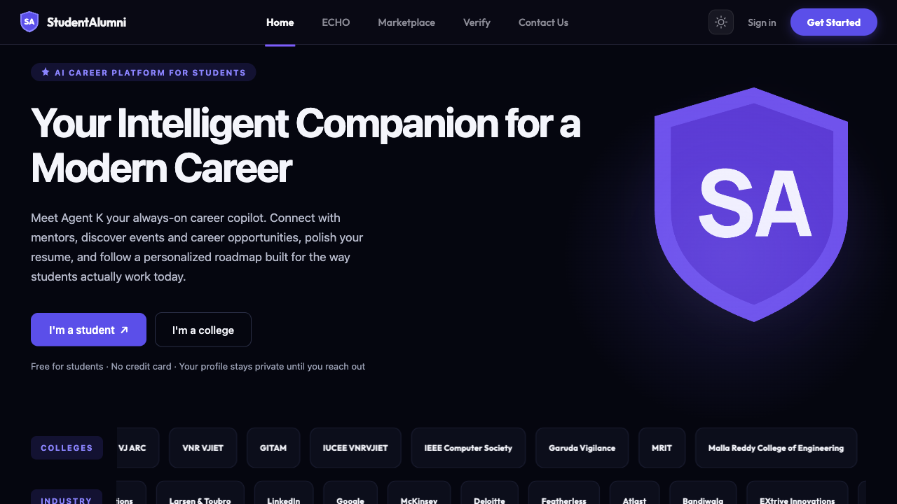

<p align="center">
  <h1 align="center">🤖 OmniQA</h1>
  <p align="center"><strong>The Autonomous QA Engineer That Actually Clicks the Buttons.</strong></p>
  <p align="center">
    <a href="#-quick-start"></a>
    
    
    
  </p>
</p>

---

### 🛑 Stop Clicking. Start Thinking.

You know the drill. A new PR merges. You open the staging site. You click *Login*. You type the test credentials. You click *Submit*. You wait for the page to load. You open the console. You take a screenshot. You write a Jira ticket. 

**Repeat 50 times a day.**

Quality Assurance isn't just about clicking buttons; it's about *thinking* about edge cases. But 80% of a QA engineer's day is wasted on repetitive, manual happy-path testing. And the alternative? Writing brittle Cypress/Selenium scripts that break the second a developer changes a CSS class.

**OmniQA changes the game.** 
You give it a URL and a plain-English prompt: *"Test the checkout flow and verify the 20% discount code applies."* 
OmniQA pops open a **real, visible Chrome window**, navigates the site like a human, finds the bug, and hands you a perfectly formatted report. 

No test scripts to maintain. No flaky DOM selectors. Just pure, autonomous QA.

<p align="center">
  
</p>

---

### ✨ Why QA Engineers Will Love This

| The Old Way 🐢 | The OmniQA Way 🚀 |
| :--- | :--- |
| **Manual Clicking:** 15 minutes to test one user flow. | **Autonomous Execution:** Watch the AI physically move the mouse and type in real-time (`headless=False`). |
| **Flaky Scripts:** `#submit-btn-v2` breaks because dev changed the ID. | **Resilient AI:** The AI reads the *context* of the page. It clicks "Submit" because it knows what Submit means. |
| **Vague Bug Reports:** "Checkout is broken." | **Evidence Packs:** Auto-generated reports with screenshots, console logs, network errors, and exact steps to reproduce. |
| **False Positives:** Failing tests because a 3rd-party analytics script timed out. | **Verdict Intelligence:** Separates real user-facing bugs from background CDN/telemetry noise. |

---

### 🧠 How It Works (The "Secret Sauce")

Most AI agents just hallucinate text. OmniQA actually *does the work*.

1. **👀 OBSERVE (0 Tokens):** Instead of burning money on screenshots, OmniQA uses "Tiered Sensors." It reads the compressed DOM text and traps console/network errors. Cost: **Zero tokens.**
2. **🤔 THINK (~800 Tokens):** The page state is sent to **Featherless.ai** (Qwen 2.5-7B). The AI reasons about the next logical step and outputs a strict JSON action.
3. **🖱️ ACT:** Playwright physically executes the click, type, or navigation on the live site.
4. **⚖️ EVALUATE:** Did a 500 error drop? Did an uncaught exception fire? The loop repeats until the bug is found or the flow is verified.

**The Result:** A full 10-step user flow audit costs roughly **8,000 tokens (~$0.02)** and takes seconds. 

---

### 🛡️ Enterprise-Grade Safety

*   **No GitHub PATs Required:** We don't ask for your repo keys. Reports are exported as clean Markdown to your clipboard, ready to paste into Jira or GitHub.
*   **Graceful Cancellation:** Hit the **Stop** button mid-audit. The browser closes cleanly, and the partial report is saved.
*   **Resilient Fallbacks:** If the AI provider hiccups, OmniQA seamlessly drops into a deterministic "Auto-Pilot" mode so your demo never crashes.
*   **Supabase RLS:** Row-Level Security ensures your audit history is locked down and secure.

---

### 🚀 Quick Start (30 Seconds to Your First Audit)

**Prereqs:** Python 3.11+, Node 18+, [Supabase](https://supabase.com) (free), [Featherless.ai](https://featherless.ai) key.

```bash
# 1. Clone and enter
git clone https://github.com/karthikeyagoud045-ANU/omni-qa-agent.git
cd omni-qa-agent

# 2. Backend setup
cd backend && python -m venv .venv && source .venv/bin/activate
pip install -r requirements.txt && playwright install chromium

# 3. Frontend setup
cd ../frontend && npm install

# 4. Configure (Paste your Supabase & Featherless keys)
cd .. && cp .env.example .env 

# 5. Launch!
./start.sh
